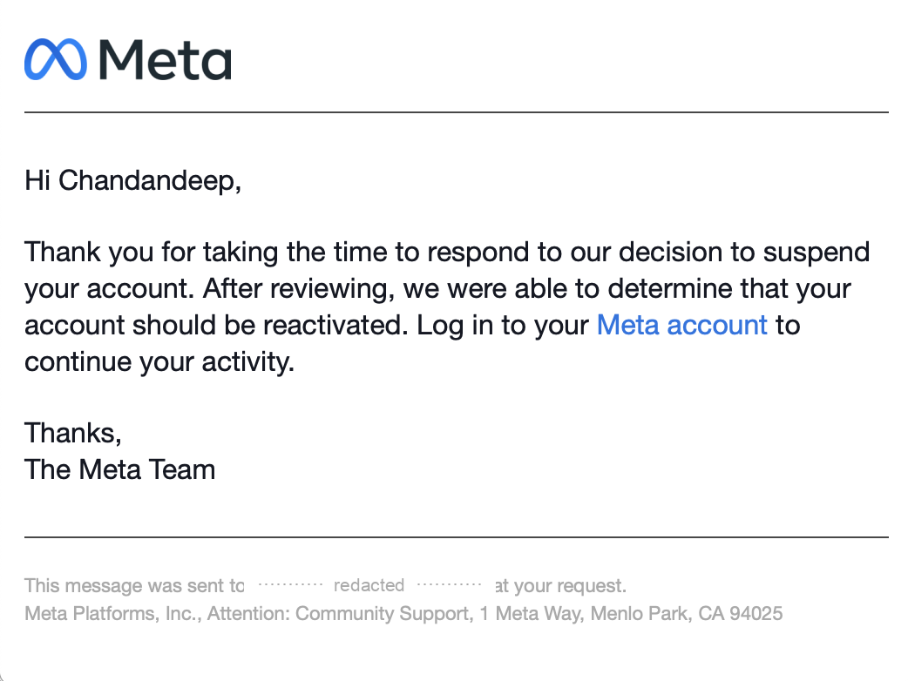
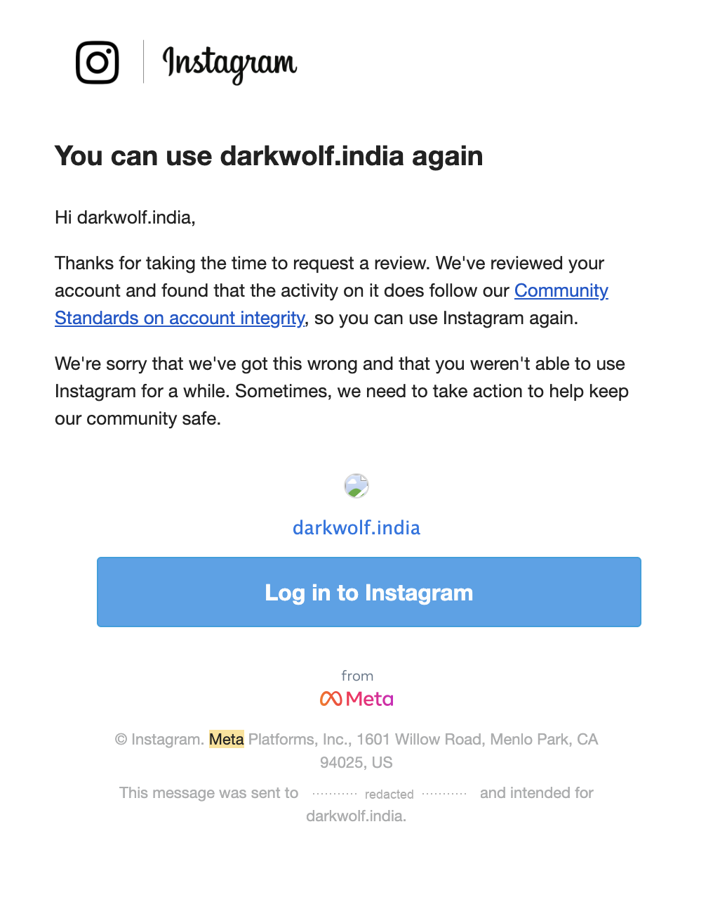
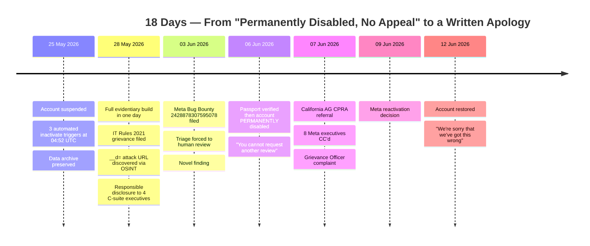
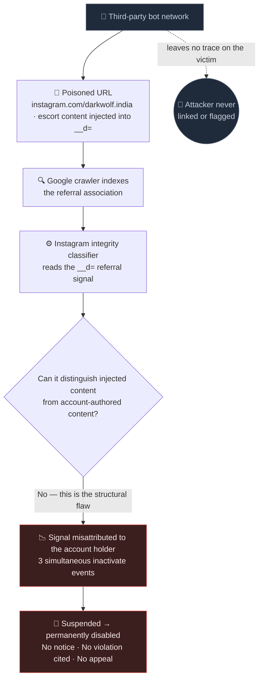
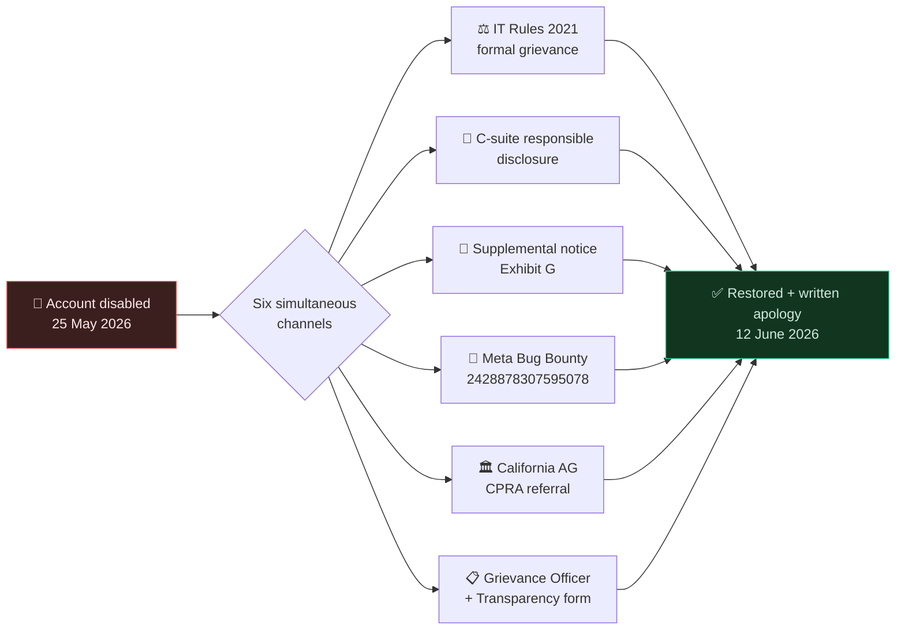

<p align="center">
  
</p>

<h1 align="center">Dark Wolf India <em>v.</em> Meta Platforms, Inc.</h1>

<p align="center">
  <em>How a third-party bot network weaponized Instagram's own enforcement architecture against an Indian MSME —<br>and how one researcher dismantled it across three jurisdictions in 18 days.</em>
</p>

<p align="center">
  
  
  
  
  
</p>

---

## The Outcome

> *"After reviewing, we were able to determine that your account should be reactivated."*
>
> — **Meta Platforms, Inc.**, reactivation determination, 9 June 2026

> *"We're sorry that we've got this wrong and that you weren't able to use Instagram for a while."*
>
> — **Instagram / Meta Platforms, Inc.**, restoration notice, 12 June 2026

<p align="center">
  
  &nbsp;&nbsp;
  
</p>

<p align="center"><sub><strong>The receipts.</strong> Left: Meta's reactivation determination (9 Jun). Right: Instagram's restoration notice and written apology (12 Jun). Recipient addresses redacted. Verbatim text: <a href="evidence/INDEX.md"><code>evidence/INDEX.md</code></a> → <em>Restoration Correspondence</em>.</sub></p>

A permanently disabled Instagram account — closed after identity verification, with **no further appeal permitted** — was restored in **18 days** through a coordinated legal, technical, and security-research campaign. The campaign identified a novel attack vector in Instagram's enforcement architecture and reported it simultaneously to Meta's CLO, CISO, CIB Director, Head of Instagram, and the California Attorney General.

This repository documents every step: the attack mechanism, the evidentiary architecture, the multi-jurisdiction legal strategy, the responsible-disclosure methodology, and the outcome.

---

## The Problem → Solution Journey



---

## The Technical Finding

### Instagram `__d=` Referral Parameter Injection → Attribution Poisoning

**The full attack URL** — publicly indexed on Google, discovered 28 May 2026:

```
https://www.instagram.com/darkwolf.india/reels/?__d=吉林辽源非常不错的三陪出差陪游%3F%2B-%2B辽源三陪.✔ %EF%B8%8Fbaoyang.shop
```

**Component breakdown:**

| Component | Value | Significance |
|---|---|---|
| Account handle | `darkwolf.india` | **Victim** — embedded in the URL base path |
| Referral content | `吉林辽源…三陪出差陪游` | Chinese adult / escort service advertising |
| URL encoding | `%3F` `%2B` | Decodes to `?` and `+` |
| Obfuscation | `%EF%B8%8F` | U+FE0F Variation Selector-16 |
| External domain | `baoyang.shop` | Disposable spam infrastructure |

The category `三陪` (*sānpéi*) denotes companion/escort services in Chinese internet slang — an adult-adjacent category that trips Instagram's integrity classifiers at a **lower threshold** than ordinary commercial spam. A deliberate choice by the attack operator.

### The Mechanism



**Critical flaw:** the classifier cannot tell content the account holder *authored or authorized* from content a third party *injected into the referral parameter*.

**Weaponizability** — the attack requires:

- ❌ zero authentication
- ❌ zero account access
- ❌ zero conduct by the victim
- ✅ fully replicable against **any** Instagram handle, at scale

---

## Forensic Corroboration

The account's **own data archive** (downloaded 25 May 2026, 13:58 UTC) contains the decisive fingerprint:

```json
{
  "profile_status_changes": [
    { "time": "May 25, 2026 4:52 am", "activation_type": "inactivate" },
    { "time": "May 25, 2026 4:52 am", "activation_type": "inactivate" },
    { "time": "May 25, 2026 4:52 am", "activation_type": "inactivate" }
  ]
}
```

Three identical events at the **same timestamp**. Manual enforcement produces a *single* event. Three simultaneous identical `inactivate` events are the signature of an **automated threshold crossing** — multiple contaminated classifier signals firing at once. The suspension email arrived ~8 hours later. The account holder had no knowledge of the attack.

📄 Full analysis: [`docs/technical/VULNERABILITY.md`](docs/technical/VULNERABILITY.md)

---

## The Campaign — Channel Architecture

Six simultaneous channels, all cross-referencing, all traceable through Meta's own systems.



> The **bug-bounty number was the skeleton key** — every email, form, and filing that could carry `#2428878307595078` did, so any Meta employee on any channel could pull the full technical record from their own system instantly. The **California AG CC on the same email as 8 executives** created cross-jurisdictional accountability no single channel could achieve.

📄 Full methodology: [`docs/disclosure/METHODOLOGY.md`](docs/disclosure/METHODOLOGY.md)

---

## The Legal Framework

| Jurisdiction | Framework | Ground |
|---|---|---|
| 🇮🇳 India | IT Rules 2021, Rule 4(8) | No prior notice, no specific violation, no human review before suspension |
| 🇮🇳 India | DPDPA 2023, §12 | Inaccurate processing — third-party signal attributed to account holder |
| 🇮🇳 India | IT Act 2000, §79 | Safe harbour misapplied — enforcement triggered by external inauthentic activity |
| 🇮🇳 India | Contract Act 1872 | Breach of implied covenant of good faith and fair dealing |
| 🇮🇳 India | Trade Marks Act 1999 | Commercial harm to pending trademark (Temp. Ref. 13094223, Class 41) |
| 🇺🇸 USA (California) | CPRA §1798.106 | Passport data processed; adverse determination made; no correction opportunity |
| 🇺🇸 USA (California) | UCL §17200 | Structural vulnerability enabling third-party weaponization = unfair practice |

---

## The Notarized Evidentiary Record

| Exhibit | Document | Nature |
|---|---|---|
| A | Udyam Registration Certificate — UDYAM-CH-01-0045213 | Original PDF |
| B | Trademark Application Form TM-A — Temp. Ref. 13094223 | Original PDF |
| C | Instagram Suspension Email — 25 May 2026 | Printed PDF |
| D | Instagram Data Archive Confirmation — 25 May 2026, 13:58 UTC | Digital Archive |
| E | Affidavit of Subham Das, Proprietor | Notarized Original |
| F | Special Power of Attorney — Chandandeep Sharma | Notarized Original |
| G | Webarchived Attack Infrastructure URL — baoyang.shop | Webarchive |

All physical exhibits notarized by Ravinder Kumar Bhatti, Notary Public, Chandigarh (UT), Regn. No. 38967.

📄 Full evidence chain: [`evidence/INDEX.md`](evidence/INDEX.md)

---

## Timeline

| Date | Event |
|---|---|
| 25 May 2026, 04:52 UTC | Three simultaneous automated cascade triggers (forensic evidence) |
| 25 May 2026, 13:58 UTC | Account data archive downloaded by account holder |
| 25 May 2026, 18:22 IST | Suspension notification received — no specific violation identified |
| 28 May 2026 | POA executed, affidavit sworn, all exhibits notarized — one day |
| 28 May 2026 | IT Rules 2021 formal grievance filed — MFL + Exhibits A–F |
| 28 May 2026 | `__d=` attack URL discovered via post-filing OSINT |
| 28 May 2026 | Supplemental Notice (Exhibit G) + responsible disclosure to 4 C-suite executives |
| 3 June 2026 | Bug Bounty Report #2428878307595078 filed |
| 3 June 2026 | Triage result: "None of the above" — novel finding confirmed |
| 6 June 2026 | Passport submitted for ID verification |
| 6 June 2026 | Meta permanently disabled account post-passport review |
| 6 June 2026 | Notice: *"You cannot request another review of this decision"* |
| 7 June 2026 | California AG CPRA enforcement referral — 8 Meta executives CC'd |
| 7 June 2026 | Indian Grievance Officer Complaint #S-1399973905294759 |
| 9 June 2026 | Meta reactivation decision made |
| 12 June 2026 | @darkwolf.india restored — written apology received |

**18 days. From "permanently disabled, no further review" to a written apology.**

📄 Full chronology: [`TIMELINE.md`](TIMELINE.md)

---

## Key Takeaways for the Security Community

1. **The `__d=` attack surface is real and replicable.** Any Instagram account can be targeted. The attack leaves no trace on the victim account and is indistinguishable from genuine integrity violations without forensic archive analysis.
2. **Account data archives are forensic gold.** Downloading your archive at the moment of anomalous activity captures the timestamped classifier signals that reconstruct the attack chain. The three simultaneous `inactivate` events were decisive.
3. **Responsible-disclosure posture changes everything.** Filing through the bug-bounty channel *alongside* legal channels repositioned the campaign from complainant to researcher.
4. **Multi-jurisdiction pressure beats single-channel appeals.** The California AG CC alongside 8 Meta executives created accountability no individual channel could.
5. **Document everything. Notarize what matters.** A notarized record filed under Indian law — affidavit, attested exhibits, Special Power of Attorney — signals a seriousness automated routing cannot ignore.

---

## Repository Structure

```
darkwolf-v-meta/
├── README.md                        ← You are here
├── TIMELINE.md                      ← Full chronological record
├── assets/
│   └── banner.svg                   ← Case banner
├── docs/
│   ├── technical/
│   │   └── VULNERABILITY.md         ← __d= attack technical analysis
│   └── disclosure/
│       └── METHODOLOGY.md           ← Responsible-disclosure approach
└── evidence/
    └── INDEX.md                     ← Evidence chain documentation
```

> Contact addresses in these documents have been redacted for publication.

---

## About

**Chandandeep Sharma**
Authorized Representative — Dark Wolf India (UDYAM-CH-01-0045213)

This campaign was executed entirely independently — no law firm, no security consultancy, no institutional support. The methodology combined real-time OSINT, multi-jurisdiction legal drafting, security research and responsible disclosure, notarized evidentiary architecture, and strategic executive escalation.

This is believed to be the first documented case in India of `__d=` referral parameter injection identified as an attribution-poisoning attack vector against Instagram's integrity classifier, with simultaneous responsible disclosure through legal, regulatory, and security-research channels to Meta's senior leadership.

Bug Bounty Report **#2428878307595078** remains open.

---

<sub><strong>Trademark & attribution.</strong> "Meta", "Instagram", and the Meta infinity mark are trademarks of Meta Platforms, Inc. The mark appears in this project's banner solely for identification and editorial commentary in documenting this case — credit to Meta Platforms, Inc. as its owner. This is an independent project and is <strong>not</strong> affiliated with, endorsed by, or sponsored by Meta Platforms, Inc. All legal filings were submitted by Chandandeep Sharma as authorized representative under Special Power of Attorney executed by Subham Das, proprietor of Dark Wolf India. Published in the public interest.</sub>
